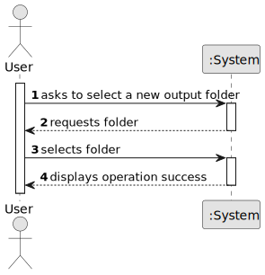

# US001 - Define Output Folder

## 1. Requirements Engineering

### 1.1. User Story Description

As a user, I want to define the output folder so that I can choose where the generated Word files will be saved.

### 1.2. Customer Specifications and Clarifications 

**From the specifications document:**

> N/A

**From the client clarifications:**

> N/A

### 1.3. Acceptance Criteria

* **AC1:** The selected folder path must exist on the file system.
* **AC2:** The application must remember the folder selection for the current session or until changed by the user.

### 1.4. Found Out Dependencies

* No dependencies to other User Stories.

### 1.5 Input and Output Data

**Input Data:**

* User-selected folder path (string)

**Output Data:**

* (In)Success of the operation

### 1.6. System Sequence Diagram (SSD)

**_Other alternatives might exist._**

### 1.7 Other Relevant Remarks

* The user may re-define the output folder at any time via the main UI.