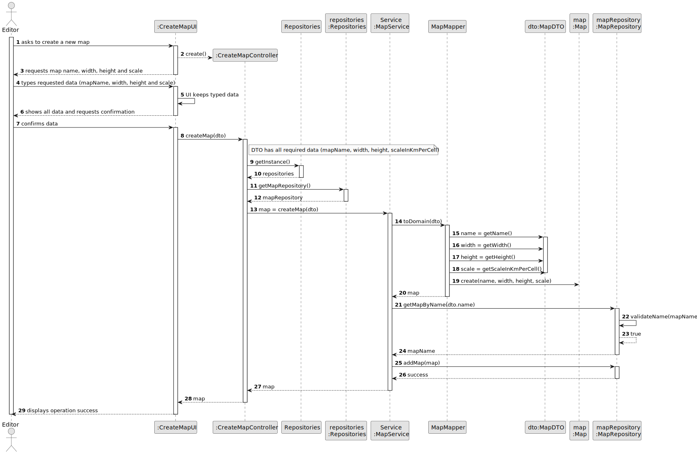
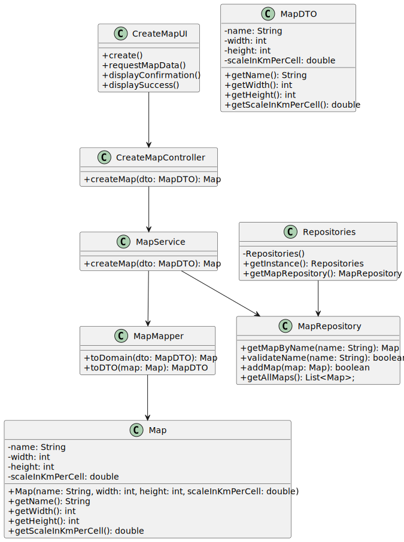

# US001 - Define Output Folder

## 3. Design

### 3.1. Rationale

| Interaction ID                             | Question: Which class is responsible for...  | Answer                  | Justification (with patterns)                                                                 |
|:-------------------------------------------|:---------------------------------------------|:------------------------|:----------------------------------------------------------------------------------------------|
| Step 1: asks to select a new output folder | ... interacting with the actor?              | OutputFolderUI          | Pure Fabrication: dedicated UI class for handling user interaction, not part of domain model. |
|                                            | ... coordinating the use case?               | OutputFolderController  | Controller: coordinates the steps and delegates to domain/service classes.                    |
| Step 2: requests folder                    | ... prompting for folder selection?          | OutputFolderUI          | Information Expert (IE): UI layer is responsible for all user interaction.                    |
| Step 3: selects folder                     | ... temporarily storing the chosen path?     | OutputFolderUI          | IE: UI maintains temporary data until it is passed to the controller.                         |
|                                            | ... validating the selected folder?          | Validator           | IE and Pure Fabrication: Knows and enforces domain rules for output folder settings.                              |
|                                            | ... saving the folder in persistent storage? | ConfigurationRepository | Repository: Responsible for persisting configuration data (SRP).                              |
| Step 4: displays operation success         | ... informing the actor of the success?      | OutputFolderUI          | Pure Fabrication: UI handles display of operation result to the user.                         |
                                           |

### Systematization

According to the taken rationale, the conceptual classes promoted to software classes are:

* Validator

Other software classes (i.e. Pure Fabrication / Service / Mapper) identified:

* OutputFolderUI
* OutputFolderController
* ConfigurationRepository

## 3.2. Sequence Diagram (SD)

### Full Diagram

This diagram shows the full sequence of interactions between the classes involved in the realization of this user story.

## 3.3. Class Diagram (CD)

