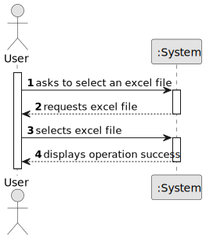

# US002 - Select Input Excel File

## 1. Requirements Engineering

### 1.1. User Story Description

As a user, I want to select the input Excel file so that the app can extract the required data for the table.

### 1.2. Customer Specifications and Clarifications 

**From the specifications document:**

> N/A

**From the client clarifications:**

> N/A

### 1.3. Acceptance Criteria

* **AC1:** The selected file must exist.
* **AC2:** The application must validate that the file is accessible (readable).
* **AC3:** The selected file must have a valid `.xlsx` or `.xlsm` extension.

### 1.4. Found Out Dependencies

* No dependencies to other User Stories.

### 1.5 Input and Output Data

**Input Data:**

* Selected data:
    * Select an Excel File

**Output Data:**

* (In)Success of the operation

### 1.6. System Sequence Diagram (SSD)

**_Other alternatives might exist._**

### 1.7 Other Relevant Remarks

* The user may re-define the Excel file path at any time via the main UI.
