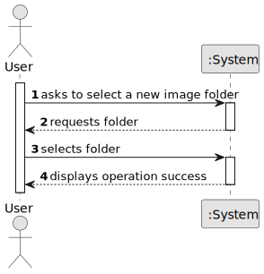

# US003 - Define Image Folder

## 1. Requirements Engineering

### 1.1. User Story Description

As a user, I want to define the input image folder so that the app can include relevant images in the generated tables.

### 1.2. Customer Specifications and Clarifications 

**From the specifications document:**

> N/A

**From the client clarifications:**

> N/A

### 1.3. Acceptance Criteria

* **AC1:** The selected folder must exist.
* **AC2:** The application must validate that the folder is accessible (readable).

### 1.4. Found Out Dependencies

* No dependencies to other User Stories.

### 1.5 Input and Output Data

**Input Data:**

* Selected data:
    * Select a Image Folder

**Output Data:**

* (In)Success of the operation

### 1.6. System Sequence Diagram (SSD)

**_Other alternatives might exist._**

### 1.7 Other Relevant Remarks

* The user may re-define the Folder file path at any time via the main UI.
