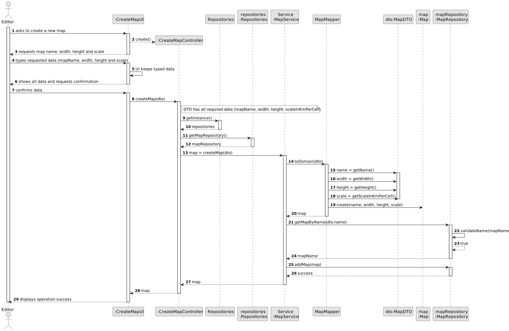

# US001 - Create a map

## 3. Design

### 3.1. Rationale

| Interaction ID                                           | Question: Which class is responsible for...        | Answer              | Justification (with patterns)                                                               |
|:---------------------------------------------------------|:---------------------------------------------------|:--------------------|:--------------------------------------------------------------------------------------------|
| Step 1: asks to create a new map                         | ... interacting with the actor?                    | CreateMapUI         | Pure Fabrication: class dedicated to user interaction, not represented in the domain model. |
|                                                          | ... coordinating the US?                           | CreateMapController | Controller: coordinates tasks and delegates work to domain or service classes.              |
| Step 2: requests map name, width and height              | ... requesting data?                               | CreateMapUI         | IE: is responsible for user interactions.                                                   |
| Step 3: types requested data (mapName, width and height) | ... saving the typed data temporarily?             | CreateMapUI         | IE: manages input data during user interaction.                                             |
| Step 4: shows all data and requests confirmation         | ... showing all input and asking for confirmation? | CreateMapUI         | IE: is responsible for user interactions.                                                   |
| Step 5: confirms data                                    | ... instantiating a MapDTO?                        | CreateMapUI         | Pure Fabrication: UI encapsulates input into DTO.                                           |
|                                                          | ... delegating map creation to service?            | CreateMapController | Controller: orchestrates creation by calling service.                                       |
|                                                          | ... mapping DTO to domain Map?                     | MapMapper           | Mapper: converts DTO to domain object.                                                      |
|                                                          | ... representing the new Map domain entity?        | Map                 | Entity: holds all map data (name, dimensions, scale, grid).                                 |
|                                                          | ... validating the Map name?                       | MapRepository       | Repository: ensures name uniqueness (SRP).                                                  |
|                                                          | ... saving the created Map?                        | MapRepository       | Repository: persists the Map instance.                                                      |
| Step 6: displays operation success                       | ... informing the actor of operation success?      | CreateMapUI         | Pure Fabrication: UI handles user notification.                                             |

### Systematization ##

According to the taken rationale, the conceptual classes promoted to software classes are: 

* Map
* MapDTO

Other software classes (i.e. Pure Fabrication / Service / Mapper) identified: 

* CreateMapUI
* CreateMapController
* MapService
* MapMapper
* MapRepository
* Repositories

## 3.2. Sequence Diagram (SD)

### Full Diagram

This diagram shows the full sequence of interactions between the classes involved in the realization of this user story.

## 3.3. Class Diagram (CD)

