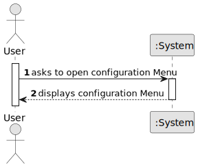

# US004 - Configure Table Generation Settings

## 1. Requirements Engineering

### 1.1. User Story Description

As a user, I want to open a configuration menu and adjust various table generation settings so that the generated Word tables meet my formatting, content, and layout preferences.

### 1.2. Customer Specifications and Clarifications 

**From the specifications document:**

> N/A

**From the client clarifications:**

> The configuration menu should centralize control over layout, image formatting, and justification settings.
> Settings must be stored persistently (e.g., in SQLite) and loaded each time the app is opened.

### 1.3. Acceptance Criteria

* **AC1:** The user can open and close a configuration menu from the main UI.
* **AC2:** The user can set the **maximum number of images per column** (integer > 0).
* **AC3:** The user can define **image size** (height and width in pixels or cm).
* **AC4:** The user can choose the **image/text order** (e.g., text above or below the image).
* **AC5:** The user can select a **justification criterium** (e.g., "Name", "Type", "Status").
* **AC6:** The user can assign a **justification text** to each value of the selected criterium.
* **AC7:** All settings are **stored persistently** (e.g., in SQLite).
* **AC8:** Saved settings are **loaded automatically** when the app starts.
* **AC9:** Validation must ensure correct and complete configuration before saving.

### 1.4. Found Out Dependencies

* SQLite database or equivalent persistent storage.
* UI framework to support dynamic form inputs and dropdowns.
* Integration with table generation engine.

### 1.5 Input and Output Data

**Input Data:**

* User-defined values:
  - Max images per column (integer)
  - Image size (height, width)
  - Image/text layout order
  - Justification criterium (dropdown selection)
  - Justification texts (key-value pairs)

**Output Data:**

* Persistent storage of settings
* Feedback on success/failure of saving
* Reflected changes in the generated table behavior

### 1.6. System Sequence Diagram (SSD)

**_Other alternatives might exist._**

### 1.7 Other Relevant Remarks

* The configuration menu may use tabs or collapsible sections to organize layout, image, and justification settings.
* Default values should be pre-loaded on first use.
* Validation messages should guide users when required fields are missing or invalid.
