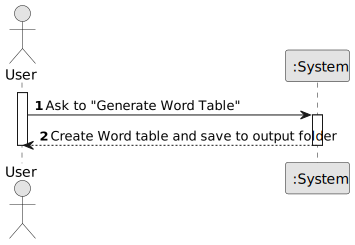

# US005 - Generate Word Table

## 1. Requirements Engineering

### 1.1. User Story Description

As a user, I want to generate a Word table from the provided Excel and image input using the current configuration so that I can directly include it in my final report.

### 1.2. Customer Specifications and Clarifications 

**From the specifications document:**

> N/A

**From the client clarifications:**

> The generated table must respect all active configuration settings (layout, image placement, justification, image size, etc.) and include relevant data from the selected Excel file and image folder.

### 1.3. Acceptance Criteria

* **AC1:** The system uses the Excel file and image folder defined in previous steps.
* **AC2:** The table generation process applies all stored configuration settings.
* **AC3:** The generated Word file must be saved in the defined output folder.
* **AC4:** If any required input is missing (Excel file, image folder, output folder, or config), the system must display an error and abort generation.
* **AC5:** The system must confirm successful generation and show the saved file location.
* **AC6:** The Word table must be formatted exactly as specified by the configuration.

### 1.4. Found Out Dependencies

* US001 – Define Output Folder  
* US002 – Select Input Excel File  
* US003 – Define Image Folder  
* US004 – Configure Table Generation Settings

### 1.5 Input and Output Data

**Input Data:**

* Path to Excel file (.xlsx)
* Path to image folder
* Output folder path
* Current configuration settings (retrieved from SQLite)

**Output Data:**
* Generated Word document (.docx) with table

### 1.6. System Sequence Diagram (SSD)

**_Other alternatives might exist._**

### 1.7 Other Relevant Remarks

* The configuration menu may use tabs or collapsible sections to organize layout, image, and justification settings.
* Default values should be pre-loaded on first use.
* Validation messages should guide users when required fields are missing or invalid.
