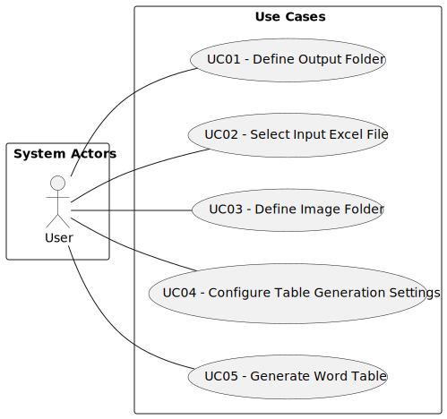

# Use Case Diagram (UCD)

**In the scope of this project, there is a direct relationship of _1 to 1_ between Use Cases (UC) and User Stories (US).**

However, be aware, this is a simplification. 

**The Use Case Diagram is shown bellow:**

### Use Cases / User Stories

**A link for the file containing the evidences of applying main activities
of the software development process (requirements, analysis, design,
tests and code) for each UC/US is provided bellow:**

| UC/US | Description                                                    |
|:------|:---------------------------------------------------------------|
| US001 | [Define Output Folder](../../US001/US001-README.md)            |
| US002 | [Select Input Excel File](../../US002/US002-README.md)         |
| US003 | [Define Image Folder](../../US003/US003-README.md)             |
| US004 | [Open Configuration Menu](../../US004/US004-README.md)         |
| US005 | [Configure Table Layout Settings](../../US005/US005-README.md) |
| US006 | [Save to SQLite](../../US006/US006-README.md)                  |
| US007 | [Generate Word Table](../../US007/US007-README.md)             |