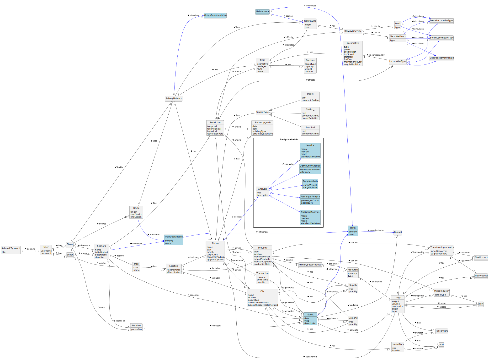

## OO Analysis

The construction process of the domain model is based on the client specifications, especially the nouns (for *concepts*) and verbs (for *relations*) used.

### Rationale to identify domain conceptual classes
Domain conceptual classes were identified by making a list of candidate conceptual classes inspired by the list of categories suggested in *Applying UML and Patterns: An Introduction to Object-Oriented Analysis and Design and Iterative Development*.

---

### **_Conceptual Class Category List_**

**Business Transactions**
- Table Generation Request

**Transaction Line Items**
- TableContent (rows, columns, images, text)

**Product/Service related to a Transaction**
- WordTable (final product)
- ExcelData (source data)
- ImageRepository (source images)

**Transaction Records**
- Configuration settings stored in SQLite

**Roles of People or Organizations**
- User

**Places**
- OutputFolder (filesystem location)
- ImageFolder (filesystem location)

**Noteworthy Events**
- Configuration change
- Table generation

**Physical Objects**
- Image
- Excel file
- Word file

**Descriptions of Things**
- Justification (criteria + text)
- Table layout settings (image size, text position, etc.)

**Containers**
- Application
- Configuration

**Elements of Containers**
- Justification entries

**Other External/Collaborating Systems**
- Local file system
- SQLite database

---

### **Rationale to identify associations**
We used the “List of Common Associations” to decide which relations are worth modeling:

- **A** is part of **B** → e.g., *Justification* is part of *Configuration*
- **A** uses **B** → e.g., *WordTable* uses *ExcelData* and *ImageRepository*
- **A** is stored in **B** → e.g., *Configuration* stored in SQLite
- **A** generates **B** → e.g., *Application* generates *WordTable*
- **A** is selected by **B** → e.g., *MainMenu* selects *ExcelData*

---

### **Association Table**

| Concept (A)             | Association      | Concept (B)             |
|-------------------------|------------------|-------------------------|
| Application             | runs as          | User                    |
| User                    | manages          | Configuration           |
| User                    | uses             | MainMenu                |
| MainMenu                | selects          | ExcelData               |
| MainMenu                | selects          | ImageRepository         |
| MainMenu                | triggers         | WordTable               |
| Configuration           | includes         | Justification           |
| Configuration           | stored in        | ConfigurationRepository |
| WordTable               | uses data from   | ExcelData               |
| WordTable               | uses images from | ImageRepository         |
| WordTable               | formatted by     | Configuration           |
| Justification           | applies to       | TableContent            |
| ConfigurationRepository | persists         | Configuration           |

## Domain Model

**Do NOT forget to identify concept atributes too.**

**Insert below the Domain Model Diagram in a SVG format**

